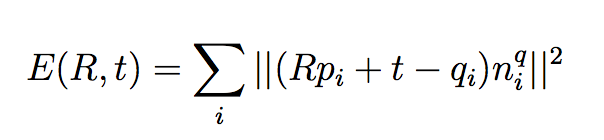

# ICP-Implementation
The main task in this assignment was to align two 3D geometeries as close as possible starting with an initial overlapping area. A widely used algorithm to achive good results is known as ”Iterative Closest Points” (ICP).

This algorithm give as output a rigid transformation formed by a rotation matrix and a translation vector. This is done solving a minimization problem where the error to minimize is defined as follow:

where p_i are the points we are trying to aling and the q_i are the reference points. Moreover R is the rotation matrix we’re trying to find and t is the translation vector.

When we want to compute the closest point to match between the two scans, instead of brute forcing the computation having O(n^2) complexity, a great speed up is given by using the KD-tree data structure where the points are stored in a tree based on their location in the space. Note that the K represents the number of dimensions in which the point lies, in this case we have a 3D tree. Therefore the time complexity for the nearest neighbour search goes down to O(log(n)).

# ICP Improvements

## Subsampling
A very straight forward improvement is trying not to use all the points in the two scans. There are different ways to correctly subsample the two scans, one in particular seem to work really nicely paying attention to some geometric constraints more details explained in the paper : [Geometrically Stable Sampling for the ICP Algorithm. url: https : / / graphics . stanford.edu/papers/stabicp/stabicp.pdf.].
However my implementation is sacrificing geometric stability but is much easier to code and provide immediate good results, because the measured time between the two ICP versions given the same two scans in input show that this version is much faster than the previous one (roughly half the time for converge).
The subsampling method used to create these two subsets is : for each sample create a pseudo-random integral number in the range between 0 and the maximum number of vertices in the scan that we want to sample from. This number is generated by an algorithm that returns a sequence of uniformely distrubuted and apparently non-related numbers each time it is called. This algorithm uses a seed to generate the series.

## Point to plane
A great improvement in time for the ICP algorithm is definitely the point to Plane error metric. In this case we are not only given the vertices of both the scans but also the normals of the reference scan. Using this extra information we can define a new minimization metric :

where n_i are the normals in the scan containing the q_i points.

# Video showing the execution of the algorithm

